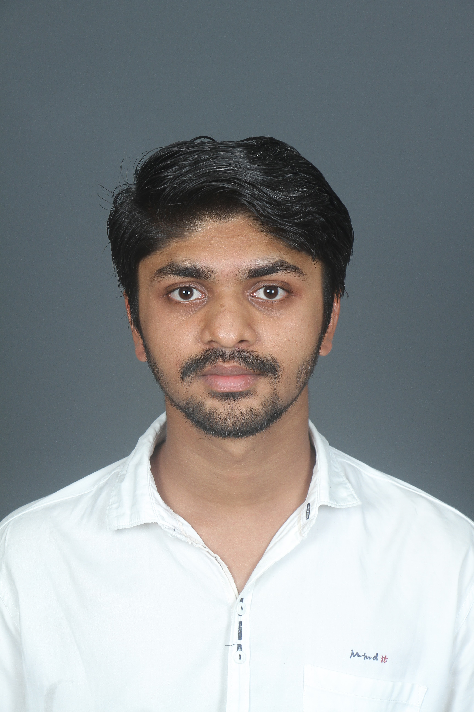

# Hello everyone!, I'm TARUN KARIGAR, an Electronics and Communication Engineer with expertise in Embedded Systems, IoT, and Python Programming 👋🏼:
🛜 My Portfolio: [Portfolio](https://linktr.ee/tarunkarigar) 👨🏼‍🎓 Aspiring to contribute to innovative projects in **Embedded Systems** and **IoT**  👨🏼‍💻 Passionate about solving real-world problems using technology  <i>tarunkarigar@example.com</i>

- 🔭 I’m currently working on **IoT-based Smart Home Automation**
- 🎓 Final-year ECE student passionate about **Embedded Systems, IoT, and Signal Processing**
- 🌱 I’m currently learning **Advanced Python for IoT and PCB Design**
- 🚀 Participating in hackathons like **Smart India Hackathon** and **VTU Project Expo**
- 💡 Exploring innovative projects like **IoT-based Health Monitoring** and **Smart Agriculture Systems**
- 👨‍💻 My recent projects include **Smart Home Automation** and **IoT-based Health Monitoring System**
- 📫 How to reach me: [LinkedIn](https://www.linkedin.com/in/tarunkarigar) | [Email](mailto:tarunkarigar@example.com)

### 🛠 Tech Stack

### 📈 GitHub Stats

### 📌 Featured Projects
- 🏆 **Smart Home Automation System** – IoT-based system to control home appliances remotely
- 🌱 **IoT-based Health Monitoring System** – Real-time health monitoring using sensors and cloud integration
- 💡 **PCB Design for Microcontroller Board** – Custom PCB design for an ESP32-based microcontroller
- 🚀 **Digital Signal Processing using Python** – Audio signal processing and analysis

### 🏆 Hackathon & Achievements
- 🌟 **Smart India Hackathon 2023** – Finalist for IoT-based Smart Agriculture Solution
- � **VTU Project Expo 2023** – Best Project Award for IoT-based Health Monitoring System
- 🚀 **IEEE Project Competition** – Participated in Embedded Systems category

### 🌍 Connect with Me
[

💻 Happy Coding!

<picture>
  <source media="(prefers-color-scheme: dark)" srcset="https://raw.githubusercontent.com/tobiasmeyhoefer/tobiasmeyhoefer/output/github-snake-dark.svg" />
  <source media="(prefers-color-scheme: light)" srcset="https://raw.githubusercontent.com/tobiasmeyhoefer/tobiasmeyhoefer/output/github-snake.svg" />
  
</picture>
